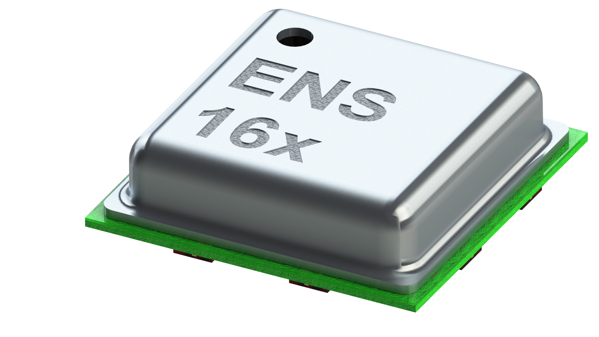
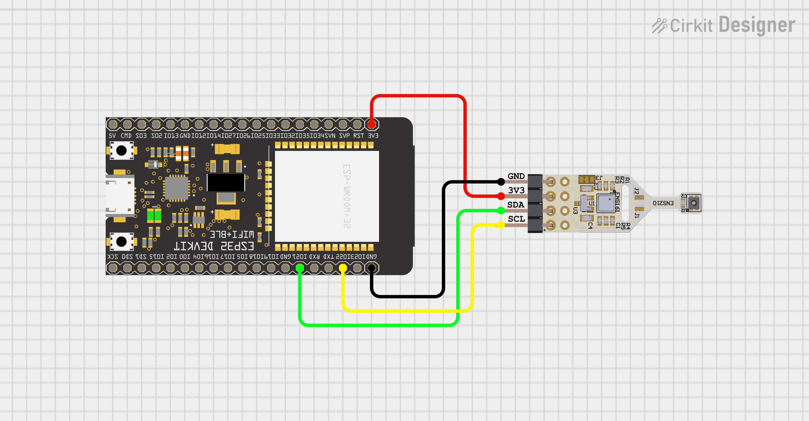

# ScioSense ENS16x Arduino Library
Arduino library for the ENS16x digital four channel MOX gas sensors with I2C interface from ScioSense.

ENS16x is a range of digital multi-gas metal oxide (MOX) sensors, specifically designed for indoor air quality 
monitoring, offering an unrivalled wealth of fully-processed outputs including low-power operating modes.

## Links
* [ENS160 Datasheet](https://www.sciosense.com/wp-content/uploads/2023/12/ENS160-Datasheet.pdf)
* [ENS161 Datasheet](https://www.sciosense.com/wp-content/uploads/2023/12/ENS161-Datasheet.pdf)
* [Further information about the ENS16x family](https://www.sciosense.com/ens16x-digital-metal-oxide-multi-gas-sensor-family/)
* Buy the ENS161 on [Mouser](https://mou.sr/3NSRp0K) or [another distributor](https://www.sciosense.com/contact/)
* Buy the ENS161 evaluation kit on [Mouser](https://mou.sr/3vxi5xJ) or [another distributor](https://www.sciosense.com/contact/)

## Prerequisites
It is assumed that
 - The Arduino IDE has been installed.
   If not, refer to "Install the Arduino Desktop IDE" on the
   [Arduino site](https://www.arduino.cc/en/Guide/HomePage).
- The library directory is at its default location. Normally this is `C:\Users\[your_username]\Documents\Arduino\libraries`.

You might need to add your board to the Arduino IDE. This library was tested with the [Espressif ESP32](https://www.espressif.com/en/products/socs/esp32). 
For the installation of the ESP32 in the Arduino IDE, see [Arduino ESP32 Installation](https://docs.espressif.com/projects/arduino-esp32/en/latest/installing.html)

## Installation

### Installation via Arduino Library Manager
- In the Arduino IDE, navigate to the Arduino Library Manager on the left side (or, alternatively, select Sketch > Include Library > Manage Libraries...)
- Search for `ScioSense_ENS16x`
- Select the library from the search results and press `Install`

### Manual installation
- Download the code from this repository via "Download ZIP".
- In Arduino IDE, select Sketch > Include Library > Add .ZIP library... and browse to the just downloaded ZIP file.
- When the IDE is ready this README.md should be located at `C:\Users\[your_username]\Documents\Arduino\libraries\ScioSense_ENS16x\README.md`.

## Wiring

### General
Please make sure that you use the correct supply voltage:
- The ENS16x runs at VDD = 1.8 V. If you are using the Sciosense ENS16x breakout board, you can use VDD = 3.3 V thanks
to the onboard LDO. 
- The I2C communication is 3.3 V tolerant.

### Example with ESP32
This example shows how to wire a [ESP32DevKitC](https://docs.espressif.com/projects/esp-idf/en/latest/esp32/hw-reference/esp32/get-started-devkitc.html#get-started-esp32-devkitc-board-front) 
with the ENS220 breakout board for I2C communication.

| ENS220 breakout board | ESP32 |
|:---------------------:|:-----:|
|          VDD          |  3V3  |
|          GND          |  GND  |
|          SDA          |  G21  |
|          SCL          |  G22  |

## Build an example
To build an example sketch
 - (Re)start Arduino.
 - Open File > Example > Examples from Custom Libraries > ScioSense_ENS16x > 01_Basic (or any other of the provided examples you wish to run)
 - Make sure Tools > Board lists the correct board.
 - Select Sketch > Verify/Compile.

## Acknowledgements
This library is developed for ScioSense by [at² GmbH](https://www.at2-software.com/en/) 

@at2software

### ScioSense is a Joint Venture of ams AG
